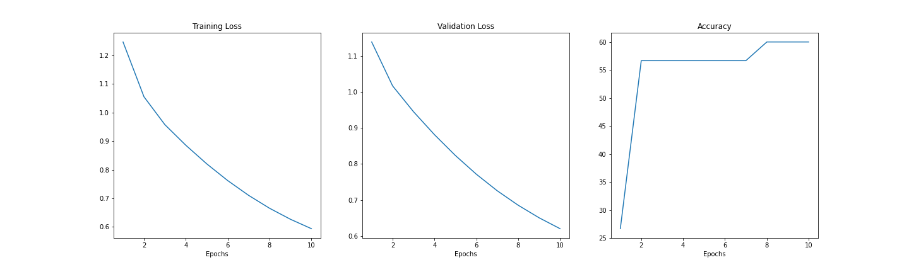

# Image Compression
Building a custom image compression network based on convolutional neural networks
## Neuroevolution of Neural Networks
The class Iris dataset is used for testing the neural network for classification.
### 1) Generic Neural Network

  

#### Model Summary
'''
----------------------------------------------------------------
        Layer (type)               Output Shape         Param #
================================================================
            Linear-1                  [5, 1, 8]              40
              ReLU-2                  [5, 1, 8]               0
            Linear-3                  [5, 1, 3]              27
        LogSoftmax-4                  [5, 1, 3]               0
================================================================
Total params: 67
Trainable params: 67
Non-trainable params: 0
----------------------------------------------------------------
Input size (MB): 0.00
Forward/backward pass size (MB): 0.00
Params size (MB): 0.00
Estimated Total Size (MB): 0.00
----------------------------------------------------------------

'''

### 2) Neuroevolution of Neural Networks