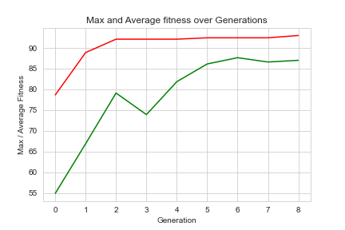
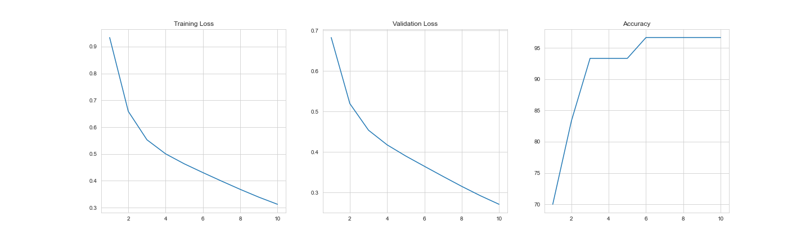
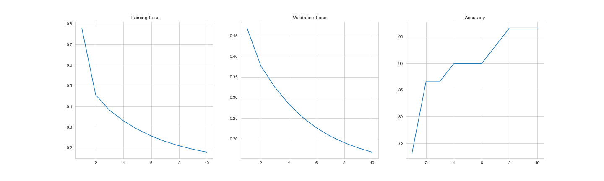

# Image Compression
Building a custom image compression network based on convolutional neural networks
## Neuroevolution of Neural Networks
The class Iris dataset is used for testing the neural network for classification.
### 1) Generic Neural Network
- Model Training and Validation

- Model Summary
```
----------------------------------------------------------------
        Layer (type)               Output Shape         Param #
================================================================
            Linear-1                  [5, 1, 8]              40
              ReLU-2                  [5, 1, 8]               0
            Linear-3                  [5, 1, 3]              27
        LogSoftmax-4                  [5, 1, 3]               0
================================================================
Total params: 67
Trainable params: 67
Non-trainable params: 0
----------------------------------------------------------------
Mean Accuracy: 54.669
Max Accuracy: 60.0 at Epoch: 8
Epoch: 10, Training Loss: 0.59, Validation Loss: 0.62, accuracy = 60.0
----------------------------------------------------------------
```


### 2) Neuroevolution of Neural Networks
- Optimization Curve
<p align="center">
  
</p>

#### Highest Fitness Model
- Model Training and Validation

- Model Summary
```
----------------------------------------------------------------
        Layer (type)               Output Shape         Param #
================================================================
            Linear-1                 [5, 1, 10]              50
              ReLU-2                 [5, 1, 10]               0
            Linear-3                  [5, 1, 7]              77
              Tanh-4                  [5, 1, 7]               0
            Linear-5                  [5, 1, 3]              24
        LogSoftmax-6                  [5, 1, 3]               0
================================================================
Total params: 151
Trainable params: 151
Non-trainable params: 0
----------------------------------------------------------------
Mean Accuracy: 91.666
Max Accuracy: 96.666 at Epoch: 5
Epoch: 10, Training Loss: 0.31, Validation Loss: 0.27, accuracy = 96.67
----------------------------------------------------------------
```
#### 2nd Highest Fitness Model
- Model Training and Validation

- Model Summary
```
----------------------------------------------------------------
        Layer (type)               Output Shape         Param #
================================================================
            Linear-1                  [5, 1, 7]              35
              ReLU-2                  [5, 1, 7]               0
            Linear-3                  [5, 1, 3]              24
        LogSoftmax-4                  [5, 1, 3]               0
================================================================
Total params: 59
Trainable params: 59
Non-trainable params: 0
----------------------------------------------------------------
Mean Accuracy: 90.0
Max Accuracy: 96.666 at Epoch: 7
Epoch: 10, Training Loss: 0.18, Validation Loss: 0.17, accuracy = 96.67
----------------------------------------------------------------

```
